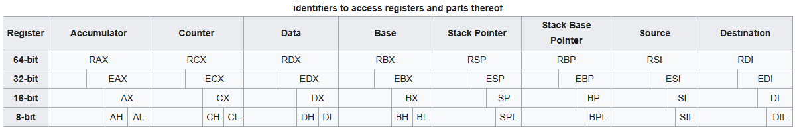

# registers

64 bit        | 32 bit          | 16 bit     | 8 bit
------------- | ----------------| ---------- | ------
**quad word** | **double word** | **word**   | **byte**
8 byte        | 4 byte          | 2 byte     | 1 byte
**q**         | **l**           | **w**      | **b**
%rax          | %eax            | %ax        | %al
%rcx          | %ecx            | %cx        | %cl
%rdx          | %edx            | %dx        | %dl
%rbx          | %ebx            | %bx        | %bl
%rsi          | %esi            | %si        | %sil
%rdi          | %edi            | %di        | %dil
%rsp          | %esp            | %sp        | %spl
%rbp          | %ebp            | %bp        | %bpl
%r8           | %r8d            | %r8w       | %r8b
%r9           | %r9d            | %r9w       | %r9b
%r10          | %r10d           | %r10w      | %r10b
%r11          | %r11d           | %r11w      | %r11b
%r12          | %r12d           | %r12w      | %r12b
%r13          | %r13d           | %r13w      | %r13b
%r14          | %r14d           | %r14w      | %r14b
%r15          | %r15d           | %r15w      | %r15b

# assembler directives
[https://ftp.gnu.org/old-gnu/Manuals/gas-2.9.1/html_chapter/as_toc.html#TOC67](https://ftp.gnu.org/old-gnu/Manuals/gas-2.9.1/html_chapter/as_toc.html#TOC67)